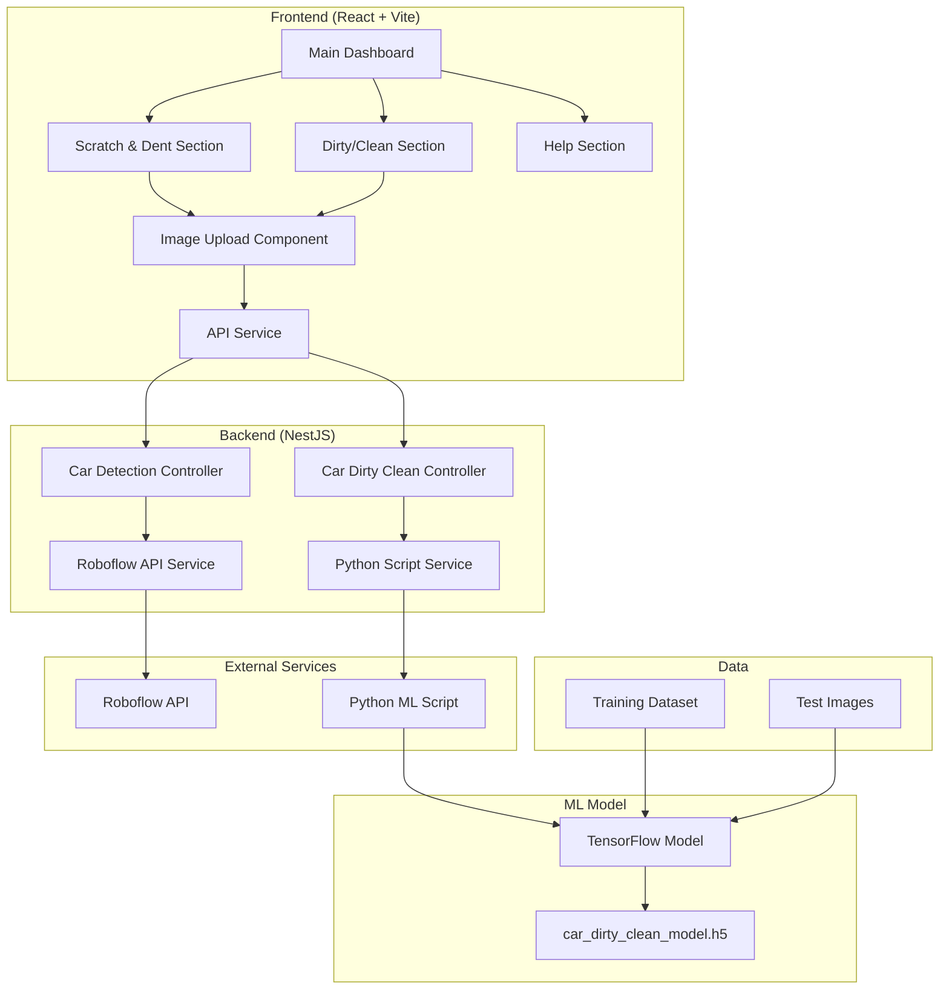

# U.P - Complete Vehicle Damage & Dirtiness Detection System

A comprehensive full-stack application that uses AI to detect car scratches, dents, and determine if a vehicle is dirty or clean. The system combines computer vision models with a modern web interface to provide accurate vehicle analysis.

## 🚗 Project Overview

This project consists of three main components:
- **Machine Learning Model**: Custom TensorFlow model for dirty/clean classification
- **Backend API**: NestJS server with dual detection endpoints
- **Frontend Dashboard**: React-based web interface with modern UI/UX

## 🏗️ System Architecture



## 📁 Project Structure

```
is-car-dirty/
├── backend/                    # NestJS API Server
│   ├── src/
│   │   ├── controllers/        # API Controllers
│   │   │   ├── car-detection.controller.ts
│   │   │   └── car-dirty-clean.controller.ts
│   │   ├── services/          # Business Logic
│   │   │   ├── car-detection.service.ts
│   │   │   └── car-dirty-clean.service.ts
│   │   ├── dto/               # Data Transfer Objects
│   │   └── app.module.ts      # Main Module
│   ├── scripts/               # Python ML Scripts
│   │   ├── car_dirty_prediction.py
│   │   └── requirements.txt
│   └── package.json
├── frontend/                   # React Web Application
│   ├── src/
│   │   ├── components/        # React Components
│   │   │   ├── MainDashboard.tsx
│   │   │   ├── ScratchDentSection.tsx
│   │   │   ├── DirtyCleanSection.tsx
│   │   │   ├── HelpSection.tsx
│   │   │   ├── ImageUpload.tsx
│   │   │   └── ImageDisplay.tsx
│   │   ├── services/          # API Integration
│   │   │   └── api.ts
│   │   ├── types/             # TypeScript Types
│   │   └── App.tsx
│   └── package.json
├── model/                      # Machine Learning Model
│   ├── car_dirty_clean_model.h5
│   ├── dataset/               # Training Data
│   │   ├── train/
│   │   │   ├── clean/         # Clean car images
│   │   │   └── dirty/         # Dirty car images
│   │   └── test/
│   │       ├── clean/
│   │       └── dirty/
│   └── untitled1.py           # Model Training Script
└── README.md
```

## 🤖 Machine Learning Model Architecture

### Model Overview
The dirty/clean classification model is built using **TensorFlow** with a **MobileNet** base architecture for efficient inference.

### Architecture Details
```python
# Model Architecture
base_model = MobileNet(
    weights='imagenet', 
    include_top=False, 
    input_shape=(224, 224, 3)
)

# Custom Classification Head
x = base_model.output
x = GlobalAveragePooling2D()(x)
x = Dense(128, activation='relu')(x)
predictions = Dense(1, activation='sigmoid')(x)

model = Model(inputs=base_model.input, outputs=predictions)
```

### Training Process
1. **Data Augmentation**: Rotation, shifting, shearing, zooming, and horizontal flipping
2. **Transfer Learning**: Pre-trained MobileNet weights from ImageNet
3. **Fine-tuning**: Two-phase training process
   - Phase 1: Train only the custom head (20 epochs)
   - Phase 2: Fine-tune the entire model (10 epochs)

### Model Specifications
- **Input Size**: 224x224x3 (RGB images)
- **Output**: Binary classification (0 = clean, 1 = dirty)
- **Optimizer**: Adam (lr=0.001 → 0.0001)
- **Loss Function**: Binary Crossentropy
- **Metrics**: Accuracy

### Dataset Structure
```
dataset/
├── train/
│   ├── clean/     # 80 clean car images
│   └── dirty/     # 50 dirty car images
└── test/
    ├── clean/     # 20 clean car images
    └── dirty/     # 20 dirty car images
```

## 🔧 Backend Architecture

### Technology Stack
- **Framework**: NestJS (Node.js)
- **Language**: TypeScript
- **HTTP Client**: Axios
- **File Upload**: Multer
- **Validation**: Class Validator

### API Endpoints

#### 1. Scratch & Dent Detection (`/car-scratch-and-dent`)
- **POST** `/upload` - Upload image for damage detection
- **POST** `/url` - Detect from image URL
- **POST** `/health` - Health check

#### 2. Dirty/Clean Detection (`/car-dirty-clean`)
- **POST** `/upload` - Upload image for classification
- **POST** `/url` - Classify from image URL
- **POST** `/health` - Health check

### Service Architecture

#### Car Detection Service
```typescript
@Injectable()
export class CarDetectionService {
  // Uses Roboflow API for scratch/dent detection
  async detectFromBase64(base64Image: string): Promise<DetectionResponseDto>
  async detectFromUrl(imageUrl: string): Promise<DetectionResponseDto>
}
```

#### Car Dirty Clean Service
```typescript
@Injectable()
export class CarDirtyCleanService {
  // Executes Python script for ML inference
  async detectFromBase64(base64Image: string): Promise<DetectionResponseDto>
  async detectFromUrl(imageUrl: string): Promise<DetectionResponseDto>
  private async executePythonScript(inputData: string): Promise<any>
}
```

### Python Integration
The backend integrates with Python through Node.js `spawn` to execute the ML prediction script:

```typescript
const pythonProcess = spawn('python3', [
  this.pythonScriptPath,
  this.modelPath,
  inputData
]);
```

## 🎨 Frontend Architecture

### Technology Stack
- **Framework**: React 19 with TypeScript
- **Build Tool**: Vite
- **Styling**: Tailwind CSS
- **UI Components**: Radix UI + Custom Components
- **Icons**: Lucide React
- **HTTP Client**: Axios

### Component Architecture

#### Main Dashboard (`MainDashboard.tsx`)
- Central navigation hub
- Section switching logic
- Responsive layout management

#### Detection Sections
- **ScratchDentSection**: Handles damage detection UI
- **DirtyCleanSection**: Manages classification UI
- **HelpSection**: Comprehensive user guide

#### Shared Components
- **ImageUpload**: File upload with drag & drop
- **ImageDisplay**: Image preview with detection overlays
- **Button**: Reusable button component

### State Management
```typescript
// Local state for each section
const [selectedImage, setSelectedImage] = useState<File | null>(null);
const [detectionResult, setDetectionResult] = useState<DetectionResponse | null>(null);
const [isLoading, setIsLoading] = useState(false);
const [error, setError] = useState<string | null>(null);
```

### API Integration
```typescript
class ApiService {
  // Separate API clients for each service
  private scratchDentApi = axios.create({ baseURL: '/car-scratch-and-dent' });
  private dirtyCleanApi = axios.create({ baseURL: '/car-dirty-clean' });
  
  // Dedicated methods for each detection type
  async uploadImageForScratchDent(file: File): Promise<DetectionResponse>
  async uploadImageForDirtyClean(file: File): Promise<DetectionResponse>
}
```

## 🚀 Getting Started

### Prerequisites
- Node.js 18+ and npm
- Python 3.8+ with pip
- Git

### Installation

1. **Clone the repository**
```bash
git clone <repository-url>
cd is-car-dirty
```

2. **Install Backend Dependencies**
```bash
cd backend
npm install
```

3. **Install Frontend Dependencies**
```bash
cd ../frontend
npm install
```

4. **Install Python Dependencies**
```bash
cd ../backend/scripts
pip install -r requirements.txt
```

5. **Set Environment Variables**
```bash
# Backend/.env
ROBOFLOW_API_KEY=your_roboflow_api_key
```

### Running the Application

1. **Start the Backend Server**
```bash
cd backend
npm run start:dev
# Server runs on http://localhost:3005
```

2. **Start the Frontend Development Server**
```bash
cd frontend
npm run dev
# Frontend runs on http://localhost:5173
```

3. **Access the Application**
Open your browser and navigate to `http://localhost:5173`

## 📊 API Documentation

### Request/Response Examples

#### Scratch & Dent Detection
```bash
curl -X POST http://localhost:3005/car-scratch-and-dent/upload \
  -F "image=@car-image.jpg"
```

**Response:**
```json
{
  "success": true,
  "predictions": [
    {
      "class": "scratch",
      "confidence": 0.85,
      "x": 100,
      "y": 150,
      "width": 200,
      "height": 100
    }
  ],
  "image": { "width": 800, "height": 600 },
  "time": 250
}
```

#### Dirty/Clean Detection
```bash
curl -X POST http://localhost:3005/car-dirty-clean/upload \
  -F "image=@car-image.jpg"
```

**Response:**
```json
{
  "success": true,
  "predictions": [
    {
      "class": "dirty",
      "confidence": 0.92,
      "x": 0,
      "y": 0,
      "width": 0,
      "height": 0
    }
  ],
  "image": { "width": 224, "height": 224 },
  "time": 1500
}
```

## 🔧 Configuration

### Backend Configuration
- **Port**: 3005 (configurable in `main.ts`)
- **CORS**: Enabled for frontend communication
- **File Upload**: Max 10MB, supports JPEG/PNG/WebP

### Frontend Configuration
- **API Base URL**: `http://localhost:3005`
- **Build Output**: `dist/` directory
- **Development Server**: Vite dev server with HMR

### Model Configuration
- **Input Size**: 224x224 pixels
- **Batch Size**: 32 (training), 1 (inference)
- **Confidence Threshold**: 0.5 for binary classification

## 🧪 Testing

### Backend Tests
```bash
cd backend
npm run test          # Unit tests
npm run test:e2e      # End-to-end tests
npm run test:cov      # Coverage report
```

### Frontend Tests
```bash
cd frontend
npm run test          # Unit tests
npm run test:coverage # Coverage report
```

## 📈 Performance Considerations

### Model Optimization
- **MobileNet**: Lightweight architecture for fast inference
- **Image Preprocessing**: Efficient resizing and normalization
- **Batch Processing**: Single image inference for real-time results

### Backend Optimization
- **Async Operations**: Non-blocking I/O for API calls
- **Error Handling**: Comprehensive error management
- **Caching**: Model loading optimization

### Frontend Optimization
- **Code Splitting**: Lazy loading of components
- **Image Compression**: Client-side image optimization
- **State Management**: Efficient re-rendering

## 🔒 Security Considerations

- **File Validation**: MIME type and size validation
- **Input Sanitization**: URL and data validation
- **Error Handling**: Secure error messages
- **CORS Configuration**: Restricted origins

## 🚀 Deployment

### Backend Deployment
1. Build the application: `npm run build`
2. Start production server: `npm run start:prod`
3. Configure reverse proxy (nginx/Apache)
4. Set environment variables

### Frontend Deployment
1. Build the application: `npm run build`
2. Deploy `dist/` directory to static hosting
3. Configure API endpoints for production

### Model Deployment
1. Ensure Python dependencies are installed
2. Verify model file path configuration
3. Test Python script execution permissions

## 🤝 Contributing

1. Fork the repository
2. Create a feature branch: `git checkout -b feature-name`
3. Commit changes: `git commit -m 'Add feature'`
4. Push to branch: `git push origin feature-name`
5. Submit a pull request

## 📝 License

This project is licensed under the MIT License - see the LICENSE file for details.

## 🆘 Support

For support and questions:
- Create an issue in the repository
- Check the Help section in the application
- Review the API documentation

## 🔮 Future Enhancements

- [ ] Additional damage types detection
- [ ] Batch image processing
- [ ] Mobile application
- [ ] Advanced analytics dashboard
- [ ] Model retraining pipeline
- [ ] Real-time video analysis
- [ ] Integration with car dealership systems

---

**Built with ❤️ using React, NestJS, TensorFlow, and modern web technologies.**
